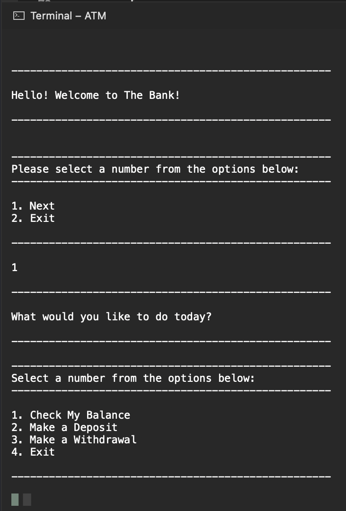

<!-- markdownlint-disable MD024 -->
# Number Games

## About

> Author: Misti Dinzy
>
> This will be built with C# and .NET, within Visual Studio Community.

---

| *Skip To...* |
|-|
| [Lab 02: *ATM*](#lab-02-atm) |
| [Lab 03: *System IO*](#lab-03-system-io) |
| [Examples](#examples)

---

## Lab 02: *ATM*

### The Problem Domain

Create a bank “ATM” program within a console application.

---

### Program Specifications

Using Test Driven Development, build out a `BankAccount` class.

Then, build a console application that imitates the functionality of an ATM, using your `BankAccount` class.

- Your solution should include the following classes:
  - `BankAccount`
    - `GetBalance()`
      - Returns the value of the current balance.
      - Starts at $0.
      - Test to ensure that the balance properly shows the correct amount after each transaction.
    - `Deposit()`
    - `Withdraw()`
  - `Program`
    - `BankAccount` account field
      - *private static readonly*
      - Initialize with a new `BankAccount()`.
      - This will hold the state of the account being accessed through the ATM.
      - `WriteWelcome()`
        - Says hello to the user. Be friendly!
      - `PromptForAction()`
        - Show the action menu and ask for an action.
        - Return the selected action (1-4).
        - If the user does not enter a valid number, return 0.
      - `PromptAndDeposit()`
        - Prompt for a deposit amount.
        - Deposit that amount into account.
        - Handle any reasonably expected errors, and show a user-friendly message.
      - `PromptAndWithdraw()`
        - Prompt for withdrawl amount.
        - Withdraw that amount from `account`.
        - Handle any reasonably expected errors, and show a user-friendly message.
      - `ViewBalance()`
        - Show balance from `account`.
      - `Main()`
        - Welcome the user, but only once.
        - Use `PromptForAction()` to request the next action.
        - For a valid action, exit or call the appropriate method and prompt again.
        - For an invalid action, prompt again.
        - Main should *not* try/catch.
        - Your program should not crash for reasonable inputs.

> ---

### Stretch Goals

- Create an `ATM` class to hold the fields and methods that were initially in the Program.js except for `Main()`.
- Create a record for, and provide a receipt for each transaction the user conducts.

---

## Lab 03: System IO

### The Problem Domain

Create a ***transaction log*** for your 'ATM' console program.

> ---

### Program Specifications

- Add a new empty `.txt` file to your console app project to hold your transaction log.
- Then navigate to the file’s `Properties` menu and set the `Copy to Output Directory:` value to be `Copy if Newer`.

- In the `BankAccount` class:
  - `WriteToLog`
  - Takes in a positive or negative amount, to be used in a log entry.
  - Writes a time-stamped transaction log entry to the file, every time a withdrawl or deposit occurs.
  - `GetLog`
    - This should be accessible by other classes, such as Program (or ATM if you did the Lab 02 stretch goal.)
    - Returns an array of transaction log entry strings.
  - `ClearLog`
    - Should be accessible to other classes.
    - Empties the file contents.
    - Use this method so that the transaction log is cleared when a new bank account is created.
- In the `Program/ATM` class:
  - Create a method named `DisplayTransactionLog`
    - Prints the contents of the transaction log.
    - Add an option to your User Interface to see the contents of the transaction log.

---

### Examples

---
